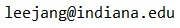

> Research Scientist\\
> ObjectVideo Labs\\
> Alarm.com\\
> \\
> 8281 Greensboro Dr., Suite 100\\
> Tysons, Virginia, 22102, USA\\
> 
>
> [Google Scholar](https://scholar.google.com/citations?user=ZR5WOkoAAAAJ&hl=en)
> [LinkedIn](https://www.linkedin.com/in/jangwon-lee-839a80a2)

--------------------------

## About Me
#### [&#9654; Curriculum vitae](./Jangwon_Lee_CV.pdf)

Hello, I am a Research Scientist in the [ObjectVideo Labs](https://objectvideolabs.com/) at [Alarm.com](https://www.alarm.com/).
I have expertise in computer vision and its application for robotics,
and have extensive research experience using deep learning frameworks ([Tensorflow](http://www.tensorflow.org/)
and [Caffe](http://caffe.berkeleyvision.org/)) and the [Robot Operating System (ROS)](http://www.ros.org/),
among many other technologies.
Before joining ObjectVideo Labs,
I was a graduate student in the [School of Informatics, Computing, and Engineering](http://www.sice.indiana.edu/)
at [Indiana University](http://www.indiana.edu/).
I worked with Professor [David Crandall](http://www.cs.indiana.edu/~djcran/)
on Computer Vision for Activity Learning
and Professor [Selma &#352;abanovi&#263;](http://homes.soic.indiana.edu/selmas/)
on Human-Robot Interaction.
I completed the Ph.D degree in July 2018.

Before IU, I was a software engineer at [Samsung Electronics](https://www.samsung.com/)
and received B.S. in Information and Communication Engineering from [Sungkyunkwan University (SKKU)](https://www.skku.edu)
in 2006 and M.S in Electrical and Computer Engineering from SKKU in 2008.

## Education
- Ph.D. in Intelligent and Interactive Systems track of Informatics, Jul 2018
  - Indiana Universitiy, Advisor: [David Crandall](http://www.cs.indiana.edu/~djcran/)
  - Co-Advisor: [Selma &#352;abanovi&#263;](http://homes.soic.indiana.edu/selmas/)
  - Dissertation: Learning Activities From Human Demonstration Videos. [PDF](./papers/leejang_phd_thesis.pdf)
  - Graduate Minor: Computer Science

- M.S. in Electrical and Computer Engineering, Feb 2008
  - Sungkyunkwan University, Advisor: [Sukhan Lee](http://isri.skku.ac.kr/)
  - Thesis: Automatic Evidence Selection and Collection for Robust Robotic Perception. [PDF](./papers/leejang_ms_thesis.pdf)

- B.S. in Electronic and Electrical Engineering, Feb 2006
  - Sungkyunkwan University

## Employment
- Research Scientist, [ObjectVideo Labs](https://objectvideolabs.com/) at Alarm.com, Sep 2018 --
- Research Assistant/Associate Instructor, [Indiana University](http://www.indiana.edu/). Sep 2013 - July 2018
- Research Intern, [NASA Jet Propulsion Laborator](https://www.jpl.nasa.gov/), Jun 2016 - Aug 2016
- Software Engineer, [Samsung](https://www.samsung.com/us/), Feb 2008 - Jul 2013
  - Samsung Electronics, Apr 2010 - Jul 2013
  - Samsung Digital Imaging, Feb 2009 - Apr 2010
  - Samsung Techwin, Feb 2008 - Feb 2009
- Research Assistant, [Sungkyunkwan University](https://www.skku.edu) Mar 2006 - Feb 2008

## Research Interest
Computer Vision, Computer Vision for Robotics, Human-Robot Interaction, Human-Robot Collaboration

## Recent publications
#### [&#9654; Full list of publications](./publications.html)

*Peer-reviewed conference papers:*
- **Jangwon Lee**, Bardia Doosti, Yupeng Gu, David Cartledge, David J. Crandall, and Christopher Raphael
In IEEE Winter Conference on Applications of Computer Vision (WACV),
Jan 2019.
(Oral and Poster, 36.0% acceptance rate).
[PDF](./papers/leejang_wacv2019.pdf)

bibtex

>
~~~~~~
@inproceedings{piano2019wacv, 
    title = {Observing Pianist Accuracy and Form with Computer Vision},
    author = {Jangwon Lee and Bardia Doosti and Yupeng Gu and David Cartledge and David J. Crandall and Christopher Raphael},
    booktitle = {IEEE Winter Conference on Applications of Computer Vision (WACV)},
    year = {2019}
}
~~~~~~

- **Jangwon Lee** and Michael S. Ryoo.
Learning Robot Activities from First-Person Human Videos
Using Convolutional Future Regression.
In IEEE/RSJ International Conference on Intelligent Robots and Systems (IROS),
Sep 2017.
[PDF](./papers/leejang_iros2017.pdf)

bibtex

>
~~~~~~
 @inproceedings{leejang_iros2017, 
    title = {Learning Robot Activities from First-Person Human Videos Using Convolutional Future Regression},
    author = {Jangwon Lee and Michael S. Ryoo}
    booktitle = {IEEE/RSJ International Conference on Intelligent Robots and Systems (IROS)},
    year = {2017}
}
~~~~~~

- Chenyou Fan, **Jangwon Lee**, Mingze Xu, Krishna Kumar Singh, Yong Jae Lee, David Crandall, and Michael S. Ryoo.
Identifying First-person Camera Wearers in Third-person Videos.
In IEEE Conference on Computer Vision and Pattern Recognition (CVPR), Jul 2017.
(Poster, 29.0% acceptance rate).
[PDF](./papers/firstthird2017cvpr.pdf)

bibtex

>
~~~~~~
@inproceedings{firstthird2017cvpr, 
    title = {Identifying first-person camera wearers in third-person videos},
    author = {Chenyou Fan and Jangwon Lee and Mingze Xu and Krishna Kumar Singh and Yong Jae Lee and David J. Crandall and Michael S. Ryoo},
    booktitle = {IEEE Conference on Computer Vision and Pattern Recognition (CVPR)},
    year = {2017}
}
~~~~~~

- **Jangwon Lee**, Jingya Wang, David Crandall, Selma &#352;abanovi&#263;, and Geoffrey Fox. 
Real-Time, Cloud-Based Object Detection for Unmanned Aerial Vehicles.
In IEEE International Conference on Robotic Computing (IRC), Apr 2017
[PDF](./papers/leejang_irc2017.pdf)

bibtex

>
~~~~~~
@inproceedings{lee2017real,
  title={Real-Time, Cloud-Based Object Detection for Unmanned Aerial Vehicles},
  author={Lee, Jangwon and Wang, Jingya and Crandall, David and {\v{S}}abanovi{\'c}, Selma and Fox, Geoffrey},
  booktitle={IEEE International Conference on Robotic Computing (IRC)},
  year={2017}
}
~~~~~~

*Peer-reviewed workshop papers:*
- Chenyou Fan, **Jangwon Lee**, and Michael S. Ryoo.
Forecasting Hand and Object Locations in Future Frames.
In European Conference on Computer Vision (ECCV) Workshop on Anticipating Human Behavior, Sept 2018.
[PDF](./papers/fan_eccv2018.pdf)

bibtex

>
~~~~~~
@inproceedings{fan2017forecasting,
  title={Forecasting hand and object locations in future frames},
  author={Fan, Chenyou and Lee, Jangwon and Ryoo, Michael S},
  booktitle={European Conference on Computer Vision (ECCV) Workshop on Anticipating Human Behavior},
  year={2018}
}
~~~~~~

*Extended abstracts and works in progress in conferences and workshops:*
- Haodan Tan, **Jangwon Lee**, and Gege Gao.
Human-Drone Interaction: Drone Delivery & Services for Social Event.
In ACM SIGCHI Conference on Designing Interactive Systems (DIS), June 2018. 
(Poster, 47.0% acceptance rate).
[PDF](./papers/tan_dis2018.pdf)

bibtex

>
~~~~~~
@inproceedings{tan2018human,
  title={Human-Drone Interaction: Drone Delivery \& Services for Social Events},
  author={Tan, Haodan and Lee, Jangwon and Gao, Gege},
  booktitle={ACM SIGCHI Conference on Designing Interactive Systems (DIS)},
  year={2018}
}
~~~~~~

- **Jangwon Lee**, Haodan Tan, Selma Šabanović, and David Crandall.
Forecasting Hand Gestures for Human-Drone Interaction.
In ACM/IEEE International Conference on Human-Robot Interaction (HRI), Late-Breaking Reports, Mar 2018.
[PDF](./papers/leejang_hri2018.pdf)

bibtex

>
~~~~~~
@inproceedings{lee2018forecasting,
  title={Forecasting Hand Gestures for Human-Drone Interaction},
  author={Lee, Jangwon and Tan, Haodan and Crandall, David and {\v{S}}abanovi{\'c}, Selma},
  booktitle={ACM/IEEE International Conference on Human-Robot Interaction (HRI)},
  year={2018}
}
~~~~~~

- **Jangwon Lee** and Michael S. Ryoo.
Learning Robot Activities from First-person human Videos Using Convolutional Future Regression.
In IEEE Conference on Computer Vision and Pattern Recognition (CVPR)
Workshop on Deep Learning for Robotic Vision (DLRV), Jul 2017.
(Spotlight Presentation). **Best paper award!**{: style="color: Purple"}
[PDF](./papers/leejang_cvpr_workshop_2017.pdf)

bibtex

>
~~~~~~
@InProceedings{Lee_2017_CVPR_Workshops,
author = {Jangwon Lee and Michael S. Ryoo},
title = {Learning Robot Activities From First-Person Human Videos Using Convolutional Future Regression},
booktitle = {The IEEE Conference on Computer Vision and Pattern Recognition (CVPR) Workshops},
year = {2017}
}
~~~~~~

## Teaching Experience

#### Associate Instructor, Indiana University, Bloomington, IN, USA.
- INFO I590/CS B659: *Vision for Intelligent Robotics*
  - with Prof. Michael S. Ryoo, Fall 2016
- INFO I427: *Search Informatics*
  - with Prof. David Crandall, Fall 2013, Fall 2014, 2015
- INFO I201: *Mathematical Foundations of Informatics*
  - with John Duncan and Saul Blanco, Spring 2014

## Awards and Scholarships
- Best Paper Award, CVPR Workshop on Deep Learning for Robotic Vision, 2017
- Travel Grant, CVPR Workshop Deep Learning for Robotic Vision, 2017
- Fellowship, four years of tuition and stipend, Indiana University, USA, 2013
- Brain Korea 21 Scholarship, Sungkyunkwan University, Korea, 2006

